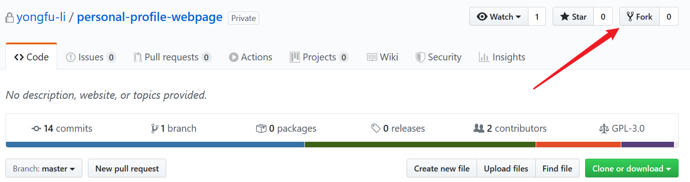
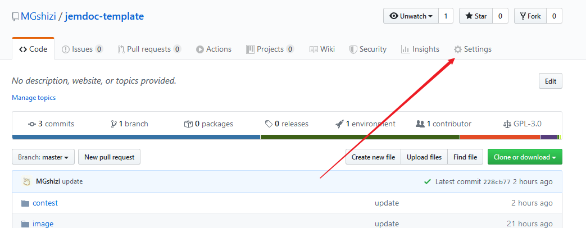
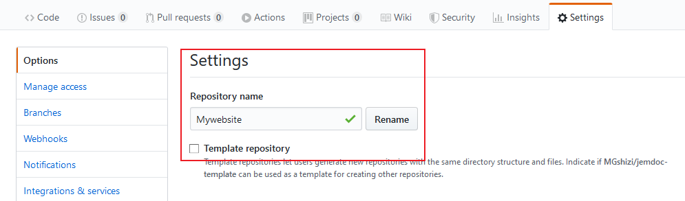
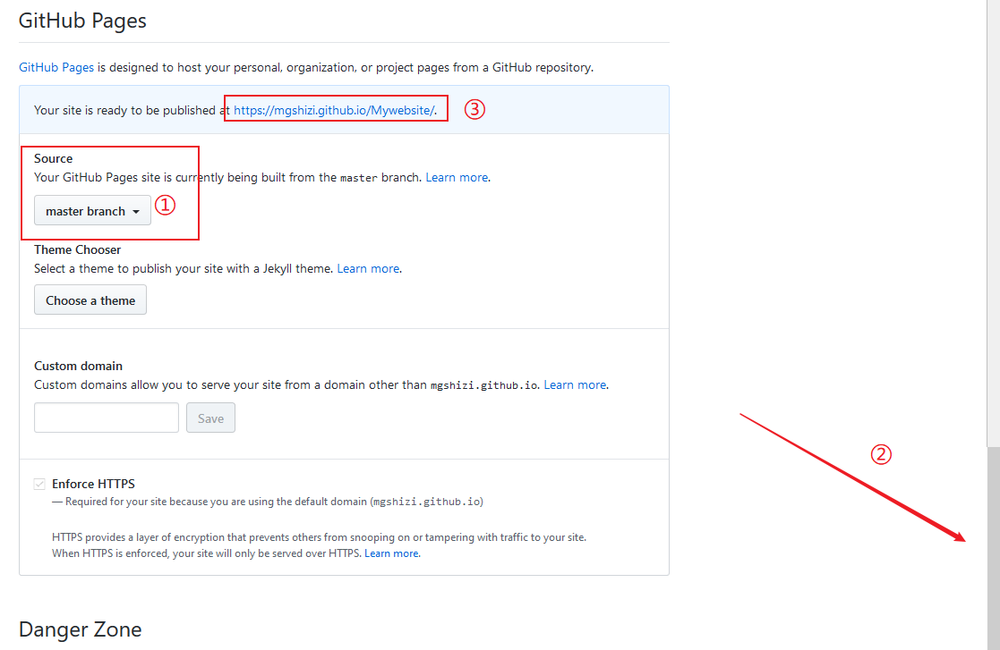
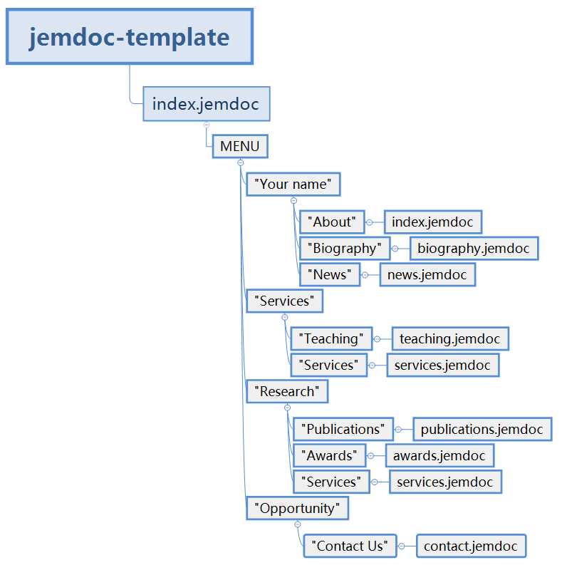

# Build up your own website based on Jemdoc & GitHub Pages


## 1. Fork template

Fork jemdoc tempalte from https://github.com/yongfu-li/personal-profile-webpage.git



## 2. Setting `GitHub Pages`

Open the repository you just forked.

- `Settings`  

  

- Rename the repository you like, eg: Mywebsite

  

- Scroll down to `GitHub Pages` -> ②, select `master branch` in the check box below `Source` -> ①, then the page will flash automatically, and you can get the website url -> ③

  

## 3. Change the template

After **cloning** the repository you just forked and renamed to local, you can change your website as like as you want.

Structure of the template:



You can change the **`.jemdoc` files** to customize your website. 

Here are some links on jemdoc:

- http://jemdoc.jaboc.net/using.html
- https://www.jianshu.com/p/88ac1961d7d6 
- https://www.jianshu.com/p/34435af74f7e

(I don't think the two '简书' instructions are useful. The information they carry can be derived from the template given by https://github.com/yongfu-li/personal-profile-webpage as long as the user have basic coding abilities. -Jiajie Huang)

> **PS:**
>
> If you want to add your publications in the website, you should follow the steps bellow:
>
> 1. Get the `BibTex` of your publication, eg, 
>
>    ```latex
>    @ARTICLE{ELL-2019-4180,
>    author={A. R. Mohamed and Y. Li and G. Wang},
>    journal={ietel},
>    title="{A Generic Nano-Watt Power Fully Tunable 1-D Gaussian Kernel Circuit for Neural Network}",
>    year={2019},
>    volume={},
>    number={},
>    pages={1-1},
>    month={},
>    }
>    ```
>
> 2. Add the `BibTex` to `./ref/publications.bib`
>
> 3. Make changes in the following line in `./jemdoc/makefile.bat` (e.g. To highlight Jiajie Huang instead of Yongfu Li, change "Y.\ Li", "Yongfu\ Li", and "Li,\ Yongfu" as "J.\Huang", "Jiajie\ Huang", and "Huang,\ Jiajie"):
>
>    > python ../ref/bibconvert.py --suffix web --highlight "$\color{red}{Y.\ Li}$" --highlight "$\color{red}{Yongfu\ Li}$" --highlight "$\color{red}{Li,\ Yongfu}$" --input ../ref/Top.bib --input ../ref/publications.bib --header publications_header.jemdoc > publications.jemdoc
>
>    this operation will highlight your name in `BibTex` automatically, and the format of your name will be given in the above code.
>
> If you want to use Chinese characters, change line 142 in jemdoc.py: replace **'utf-8'** with **'GBK'**.

## 4. Update your website

After changing the ".jemdoc" files on your desktop, run the command follow:

Windows:
```shell
run1
run2
```

Linux:
```shell
./run1.bat
./run2.bat
```

After pushing the changes to your repo, your website will be updated.
